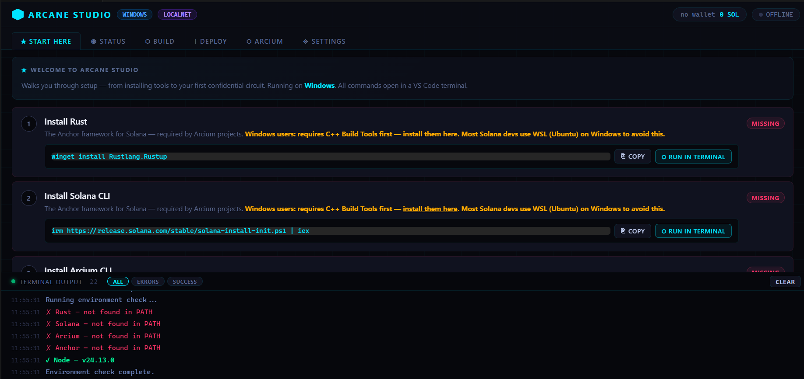

# ⬡ Arcane Studio for VS Code

> *"Building on Arcium shouldn't be hard — that is why I built this extension."*

[](https://code.visualstudio.com)
[](https://arcium.com)
[](https://solana.com)
[](LICENSE)

**Arcane Studio** is a free, open-source VS Code extension that makes building confidential Solana programs with **Arcium** simple, guided, and enjoyable — even if you've never written a smart contract before.


*The Arcane Studio dashboard — your all-in-one workspace for confidential computing.*

---

## 🌟 What Is Arcane Studio?

If you're new to blockchain development, here's the simple version:

| Term | What It Means |
|------|--------------|
| **Solana** | A fast, low-cost blockchain where you can build apps (like games, marketplaces, or tools) |
| **Arcium** | A toolkit that lets your Solana apps handle *private data* — like votes, bids, or personal info — without revealing it publicly |
| **Confidential Computing** | Doing calculations on encrypted data so no one (not even the blockchain) can see the inputs, only the result |
| **Arcane Studio** | A friendly VS Code extension that guides you through setting up, building, and deploying Arcium programs — no command-line expertise required |

🎯 **You don't need to be a cryptography expert.** Arcane Studio handles the complex parts so you can focus on *what* you want to build.

---

## ✨ Features

### 🛠️ One-Click Setup
- Auto-detects your operating system (Windows, macOS, or Linux)
- Provides copy-paste or one-click terminal commands to install:
  - ✅ Rust (the language Solana uses)
  - ✅ Solana CLI (tools to talk to the blockchain)
  - ✅ Arcium CLI (tools for confidential computing)
  - ✅ Anchor (Solana development framework)
  - ✅ Node.js (for running setup scripts)

### 🔐 Guided Arcium Workflow
Follow a clear 5-step process — no guessing what to do next:

```
1️⃣ Initialize Project  →  Creates your project folder + config
2️⃣ Build Circuits     →  Compiles your confidential logic
3️⃣ Test Locally       →  Run tests on your machine (free, no real SOL)
4️⃣ Deploy MXE         →  Launch your program + confidential engine on-chain
5️⃣ Initialize Logic   →  Tell the network what your program can do
```

### 🧪 Smart Developer Tools
- **Circuit Scaffolder**: Generate starter code for private voting, sealed auctions, encrypted sums, and more
- **Error Explainer**: See human-friendly messages when something goes wrong (no more cryptic compiler errors!)
- **Log Filter**: Focus on errors, successes, or see everything — with persistent history
- **Arcium.toml Viewer**: Peek at your config file without leaving the dashboard

### 💡 Quality-of-Life Enhancements
- 🔄 **Persistent State**: Your logs, program IDs, and settings save between VS Code sessions
- ⚡ **Auto-Airdrop Prompt**: Gets reminded to get test SOL when your wallet is empty
- 🔗 **Explorer Links**: Click to view your deployed program on Solana Explorer
- 📁 **Multi-Project Support**: Switch between different project folders seamlessly
- 🎨 **Beautiful UI**: Dark-themed, animated, and designed for long coding sessions

---

## 📥 Installation (From GitHub Releases)

> ⚠️ **No technical skills needed!** Follow these steps exactly.

### Step 1: Install VS Code (If You Haven't Already)

1. Go to [https://code.visualstudio.com](https://code.visualstudio.com)
2. Click the big blue **Download** button for your operating system
3. Run the installer and follow the prompts
4. Open VS Code when it's done

✅ *VS Code is free, open-source, and works on Windows, macOS, and Linux.*

### Step 2: Download the Extension File

1. Go to the **[Releases page](https://github.com/PhantomTee/arcane-studio/releases)** of this repository
2. Find the latest version (e.g., `v0.1.0`)
3. Under **Assets**, click to download:  
   📦 `arcane-studio-0.1.0.vsix`

> 💡 The `.vsix` file is the installable package for VS Code extensions — like an `.exe` for VS Code.

### Step 3: Install the Extension in VS Code

#### Option A: Using the VS Code Interface (Easiest)

1. Open VS Code
2. Click the **Extensions** icon in the left sidebar (or press `Ctrl+Shift+X` / `Cmd+Shift+X`)
3. Click the **⋮ (three dots)** menu at the top of the Extensions panel
4. Select **"Install from VSIX..."**
5. Navigate to where you downloaded `arcane-studio-0.1.0.vsix`
6. Select it and click **Install**
7. Wait ~10 seconds — you'll see a notification: *"Arcane Studio was successfully installed"*

#### Option B: Using the Command Line (Advanced)

If you're comfortable with Terminal/Command Prompt:

```bash
# Navigate to where you downloaded the file
cd ~/Downloads

# Install using VS Code's command
code --install-extension arcane-studio-0.1.0.vsix
```

### Step 4: Verify Installation

1. Look at the left sidebar (Activity Bar) in VS Code
2. You should see a new icon: ⬡ **Arcane Studio**
3. Click it — the dashboard should open! 🎉

> ❓ *Don't see the icon?* Try reloading VS Code: Press `Ctrl+Shift+P` (or `Cmd+Shift+P` on Mac) → type "Reload Window" → press Enter.

---

## 🚀 Quick Start Guide

### 🎯 Goal: Run your first confidential circuit in <10 minutes

#### 1️⃣ Open a Project Folder
Arcane Studio works inside a project folder.

- If you have a project: `File` → `Open Folder...` → select your project
- If you're starting fresh: Create a new folder anywhere, then open it in VS Code

#### 2️⃣ Launch Arcane Studio
- Click the ⬡ **Arcane Studio** icon in the left sidebar  
  *or*  
- Press `Ctrl+Shift+P` → type `Arcane Studio: Open Dashboard` → press Enter

#### 3️⃣ Follow the "★ Start Here" Tab
The extension will guide you:

```
✅ Step 1: Install Tools
   • Click "Run in Terminal" next to each tool
   • Wait for the green "✓ Done" badge

✅ Step 2: Create a Wallet
   • Click "Run in Terminal" for the keygen command
   • Your wallet address will appear in the dashboard

✅ Step 3: Get Test SOL
   • Click "⚡ Airdrop" → "2 SOL"
   • Wait ~15 seconds — your balance will update

✅ Step 4: Initialize Arcium Project
   • Type a project name (e.g., `my-private-vote`)
   • Click "▶ Run"
   • Watch for: "✓ Project initialized"

✅ Step 5: Build & Test
   • Click "▶ arcium build"
   • Then click "▶ arcium test"
   • Green checkmarks = success! 🎉
```

#### 4️⃣ You're Ready to Build!
Now you can:
- ✏️ Edit your circuit logic in `encrypted-ixs/`
- 🔄 Rebuild anytime with one click
- 🌐 Deploy to devnet when you're ready
- 🔍 View results on Solana Explorer

---

## 📘 How to Use: Detailed Walkthrough

### 🏠 Dashboard Tabs Explained

| Tab | What It Does | When to Use It |
|-----|-------------|----------------|
| **★ Start Here** | Guided setup wizard | First time using Arcane Studio |
| **◉ Status** | Check tools, validator, wallet, network | Anytime you want to verify your environment |
| **⬡ Build** | Scaffold circuits, compile code, manage dependencies | When writing or updating your confidential logic |
| **↑ Deploy** | Deploy programs, switch networks, view deployed contracts | When you're ready to go live (or test on devnet) |
| **⬡ Arcium** | Full 5-step Arcium workflow | For all Arcium-specific development |
| **◈ Settings** | Manage wallet, view RPC endpoints, see last program ID | For advanced configuration |

### 🔧 Common Tasks

#### ▶️ Start/Stop the Local Validator
*Why?* You need a local blockchain to test without spending real money.

1. Go to **◉ Status** tab
2. Find the "Validator Node" card
3. Click **▶ Start Validator** (or **⏹ Stop** to shut it down)
4. Watch the log for: `✓ Validator is LIVE`

#### 💰 Request Test SOL (Airdrop)
*Why?* You need SOL to pay for deploying programs — but test networks give it away free.

1. Go to **◉ Status** → Wallet card
2. Click **⚡ Airdrop**
3. Choose an amount (1, 2, or 5 SOL)
4. Wait ~15 seconds — your balance updates automatically

> 💡 Tip: On devnet, you can airdrop up to 2 SOL every ~60 seconds.

#### 🧱 Build Your Circuit
*Why?* Turns your Rust/Arcis code into a deployable program.

1. Go to **⬡ Build** tab
2. (Optional) Use "Circuit Scaffold" to generate starter code
3. Click **⚙ cargo build-sbf** (for plain Solana)  
   *or*  
   Go to **⬡ Arcium** → Step 2 → Click **▶ arcium build**
4. Watch the log — green = success, red = click the error for help

#### 🚀 Deploy to Devnet
*Why?* Share your program with others or test in a real network environment.

1. Go to **↑ Deploy** tab
2. In the "Network" card, select **Devnet**
3. Make sure your wallet has SOL (airdrop if needed)
4. Click **↑ solana program deploy**  
   *or for Arcium projects:*  
   Go to **⬡ Arcium** → Step 4 → Configure options → Click **▶ arcium deploy**
5. When done, click **⬡ View on Explorer** to see your program live

---

## ❓ Troubleshooting

### 🚫 "Command not found: arcium" or "solana: command not found"
**Cause**: The tool isn't installed or isn't in your system PATH.

**Fix**:
1. Go to **★ Start Here** tab
2. Find the missing tool (e.g., Arcium)
3. Click **⬡ Install** → **Run in Terminal**
4. Wait for the terminal to finish (may take 1-5 minutes)
5. Click **↻ Re-check** in the Status tab

> 💡 On Windows: After installing, you may need to **restart VS Code** for PATH changes to take effect.

### 🔴 Validator Won't Start / "Address already in use"
**Cause**: Port 8899 is busy (another Solana process is running).

**Fix**:
1. Close other terminal windows running `solana-test-validator`
2. Or click **⏹ Stop Validator** in Arcane Studio, wait 5 seconds, then try again
3. Still stuck? Restart your computer and try once more

### 💸 Airdrop Fails / "Account not found"
**Cause**: You're trying to airdrop on mainnet (real money network) — airdrops only work on test networks.

**Fix**:
1. Go to **↑ Deploy** → Network card
2. Select **Devnet** or **Localnet**
3. Try the airdrop again

> ✅ Arcane Studio now adds `--url devnet` automatically to prevent this!

### 🧩 Build Error: "cannot find type `ArcisU64`" or similar
**Cause**: Missing import statement in your circuit file.

**Fix**:
1. Click the error in the log — Arcane Studio shows a helpful explanation
2. Open your circuit file in `encrypted-ixs/`
3. Add this line at the top:
   ```rust
   use arcis_imports::*;
   ```
4. Rebuild

### 📁 "No Arcium.toml found" Warning
**Cause**: You haven't initialized an Arcium project in this folder yet.

**Fix**:
1. Go to **⬡ Arcium** tab → Step 1
2. Enter a project name
3. Click **▶ Run**
4. Wait for "✓ Project initialized"
5. The warning will disappear

### 🔄 Extension Doesn't Load / Blank Dashboard
**Fix**:
1. Press `Ctrl+Shift+P` → type `Developer: Reload Window` → press Enter
2. If still blank: Uninstall the extension, restart VS Code, then reinstall from the `.vsix` file

---

## 🤝 Contributing

Love Arcane Studio? Want to make it even better? Contributions are welcome! 🙌

### How to Contribute

1. **Fork** this repository
2. **Create a branch** for your feature:  
   ```bash
   git checkout -b feat/your-awesome-idea
   ```
3. **Make your changes** (follow the code style in `extension.ts`)
4. **Test locally**:  
   ```bash
   npm install
   npm run compile
   code --extensionDevelopmentPath=.
   ```
5. **Run linting**:  
   ```bash
   npm run lint
   ```
6. **Submit a Pull Request** with:
   - A clear title and description
   - Screenshots if you changed the UI
   - Reference any related issues

### Ideas We'd Love to See
- [ ] Support for more circuit templates (ZK-ML, private auctions, etc.)
- [ ] Integration with IPFS for large circuit storage
- [ ] Dark/light theme toggle
- [ ] Keyboard shortcuts for power users
- [ ] Tutorial mode for absolute beginners

> 💬 Not a coder? You can still help! Report bugs, suggest features, or improve documentation via [Issues](https://github.com/PhantomTee/arcane-studio/issues).

---

## 🔐 Privacy & Security

Arcane Studio is **open-source and transparent**:

- ✅ All code is visible in this repository — no hidden telemetry
- ✅ No data is sent to external servers (except when you explicitly deploy to Solana)
- ✅ Terminal commands are shown before execution — you're always in control
- ✅ Wallet keys stay on your machine — the extension never accesses your private key

> 🔒 Your security matters. If you find a vulnerability, please email [phantomtee54@gmail.com] responsibly.

---

## 📜 License

This project is licensed under the **MIT License** — feel free to use, modify, and share.

See [LICENSE](LICENSE) for details.

---

## 🙏 Acknowledgements

Arcane Studio exists because of amazing open-source projects and communities:

- 🦀 [Rust](https://rust-lang.org) — The language powering Solana
- ⬡ [Solana](https://solana.com) — The high-performance blockchain
- 🔐 [Arcium](https://arcium.com) — Making confidential computing accessible
- 🪝 [Anchor](https://anchor-lang.com) — The Solana development framework
- 💙 [VS Code](https://code.visualstudio.com) — The editor that makes extensions possible

And to every developer who's ever struggled with a cryptic error message — this one's for you. 🫶

---

## 📬 Get in Touch

- 🐛 **Report a bug**: [Open an Issue](https://github.com/PhantomTee/arcane-studio/issues)
- 💡 **Request a feature**: [Start a Discussion](https://github.com/PhantomTee/arcane-studio/discussions)
- 💬 **Chat with me**: [Chat on Telegram](https://t.me/montellecky) *(optional)*
- 🐦 **Follow updates**: [@your-handle on X/Twitter](https://twitter.com/0x___Ygen) *(optional)*

---

> *"The best tools disappear — leaving only your creativity."*  
> — Built with ❤️ for the confidential computing community

[⬡ Download Latest Release](https://github.com/PhantomTee/arcane-studio/releases/latest) • [📖 View Documentation](https://github.com/PhantomTee/arcane-studio/wiki) • [🐛 Report Issue](https://github.com/PhantomTee/arcane-studio/issues)